# Sentiment Analysis of COVID-19 Vaccine Tweets

Using the TextBlob API and word cloud visualizations to synthesize the discourse surrounding global vaccination efforts and progress

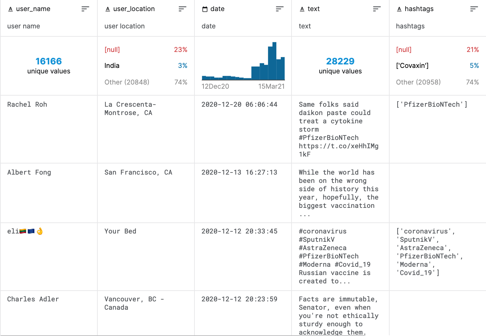

## Sentiment Analysis
#### Top 10 most retweeted tweets

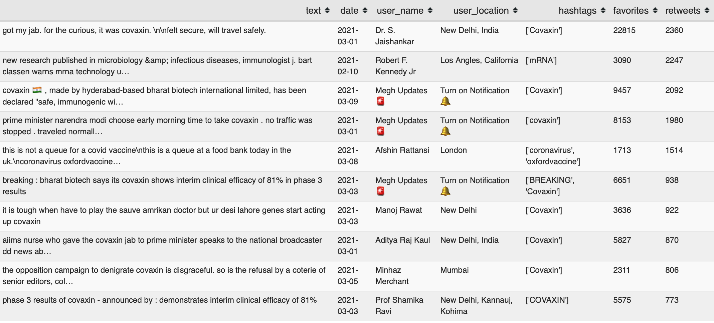 

#### Top 10 most positively charged tweets

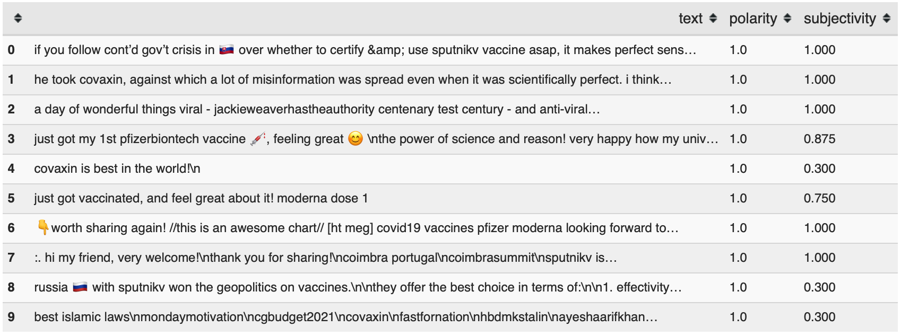 

#### Top 10 most negatively charged tweets

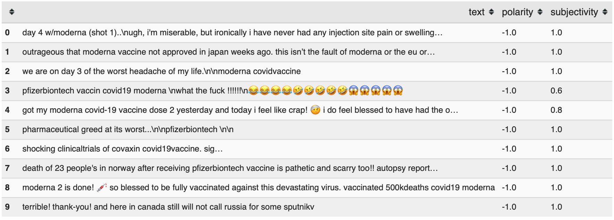 

#### Polarity and Subjectivity Distributions for all tweets

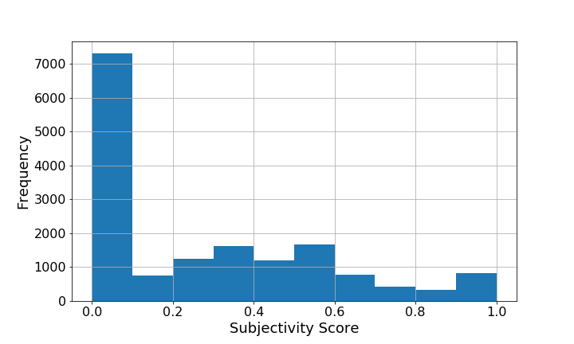

## Time Series Analysis

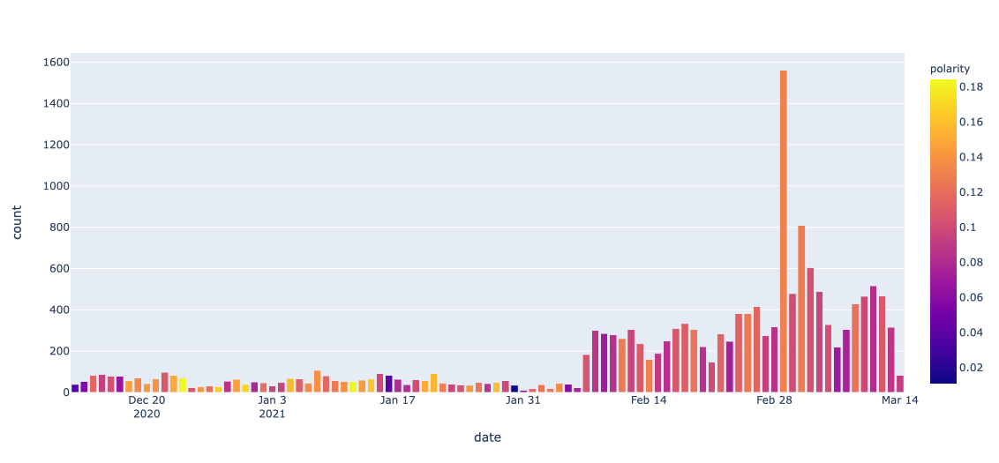 

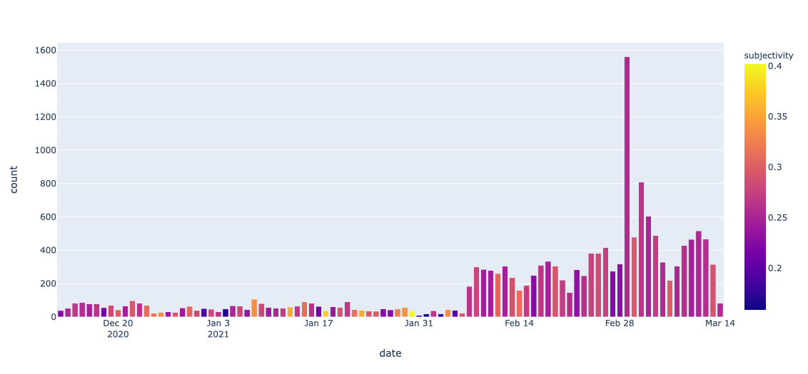 

## Word Clouds

#### All tweets

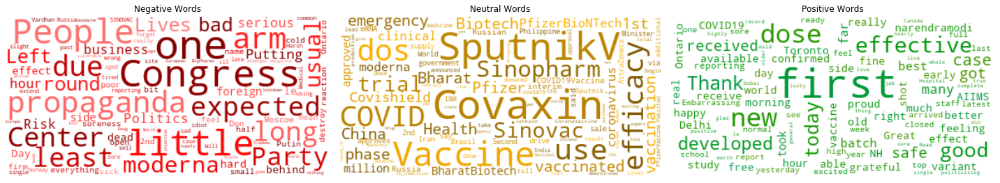 

#### Pfizer / BioNTech

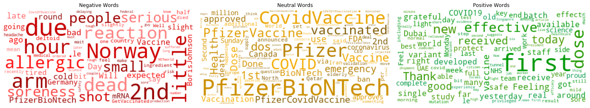 

#### Moderna

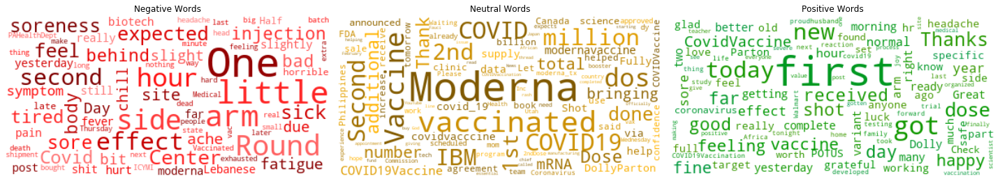 

#### Covaxin

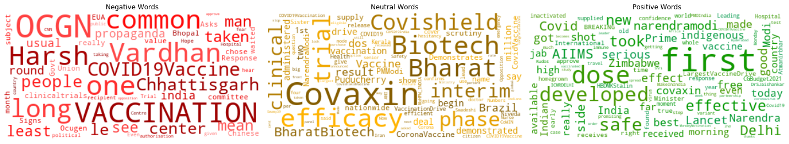 